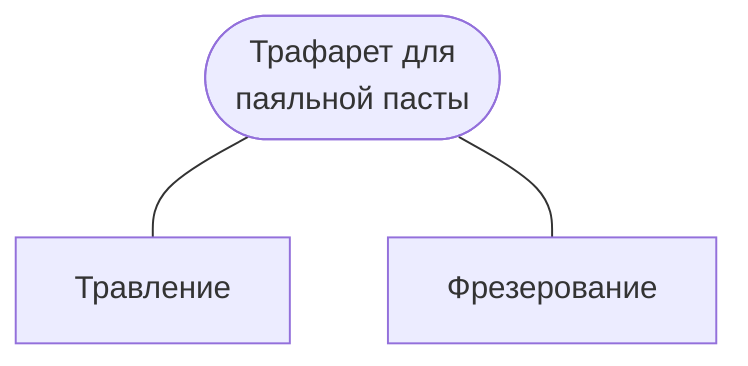

# Трафарет для паяльной пасты

## Материалы

1. Нержавеющая сталь.
2. Алюминий.

Используют алюминиевые банки из под напитков (пиво, газировки и т.д.):  
Требуется аккуратно отезать дно и верх банки. Разрезать получившийся цилиндр. Придавить, нареть, медленно остудить под грузом. Кто-то использует для этих целей бытовой утюг. У меня утюгом идеального результата не получалось, вероятно, из-за нехватки температуры. Работать с такой заготовкой можно, но несколько неудобно. Для "идеального" выпрямления рекомендуют греть примерно до 255 гр.Цельсия.  
Затем следует очистить защитные покрытия банки с обоих сторон. Внутренняя сторона покрыта защитным слоем, хоть на глаз его и не видно. Для зачистки рекомендуется использовать наждачку зернистостью 320 на мягкой подложек (губке)

## Травление

Рецепт раствора:
1. Перекись водорода 3% - 50 мл.
2. Лимонная кислота - 2 чайные ложки.
3. Соль поваренная - 2 чайные ложки.
