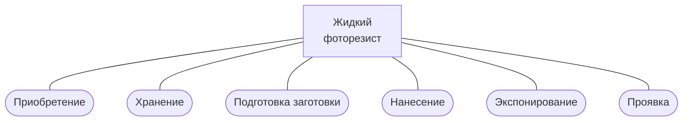

# Защита меди жидким фоторезистом

```mermaid
flowchart
	n16["Жидкий
	фоторезист"]
	n16 --- n32@{ shape: "stadium", label: "Приобретение" }
	n16 --- n38@{ shape: "stadium", label: "Хранение" }
	n16 --- n39@{ shape: "stadium", label: "Подготовка заготовки" }
	n16 --- n41@{ shape: "stadium", label: "Нанесение" }
	n16 --- n34@{ shape: "stadium", label: "Экспонирование" }
		click n34 "https://github.com/ufrs12/PCB-making/blob/main/MD/expo/expo.md"
	n16 --- n35@{ shape: "stadium", label: "Проявка" }
```
