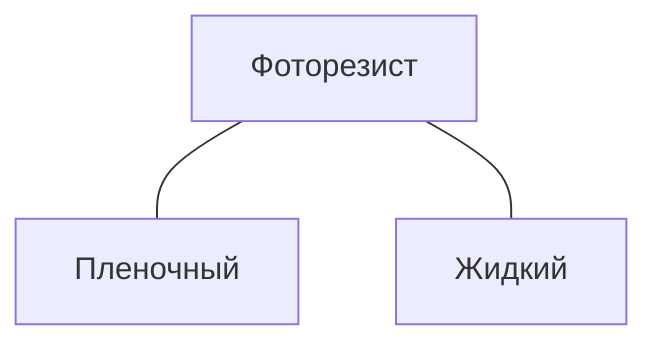

# Защита меди при травление фоторезистом

```mermaid
flowchart
	n12["Фоторезист"]

	n12 --- n15["Пленочный"]
		click n15 "https://github.com/ufrs12/PCB-making/blob/main/MD/etching/photorez/plen_ph_rez/plen_ph_rez.md"
	n12 --- n16["Жидкий"]
		click n16 "https://github.com/ufrs12/PCB-making/blob/main/MD/etching/photorez/liquid_ph_rez/liquid_ph_rez.md"
```
