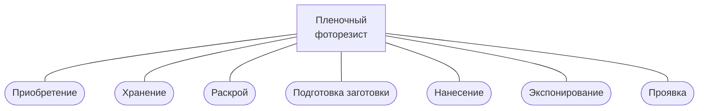

# Защита меди пленочным фоторезистом

```mermaid
flowchart
	n15["Пленочный
	фоторезист"]

	n15 --- n27@{ shape: "stadium", label: "Приобретение" }
	n15 --- n28@{ shape: "stadium", label: "Хранение" }
	n15 --- n29@{ shape: "stadium", label: "Раскрой" }
		click n29 "https://github.com/ufrs12/PCB-making/blob/main/MD/etching/photorez/plen_ph_rez/raskroy/raskroy.md"
	n15 --- n31@{ shape: "stadium", label: "Подготовка заготовки" }
	n15 --- n40@{ shape: "stadium", label: "Нанесение" }
	n15 --- n30@{ shape: "stadium", label: "Экспонирование" }
		click n30 "https://github.com/ufrs12/PCB-making/blob/main/MD/expo/expo.md"
	n15 --- n33@{ shape: "stadium", label: "Проявка" }
```
