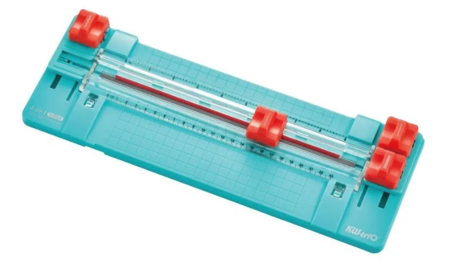

# Раскрой пленочного фоторезиста
Раскраивают ножницами, канцелярскими ножами, роторными ножами.  
Для удобства используют приспособы для раскроя подобных конструкций:  

 

Если требуется резать много и точно, то можно использовать станок подобной конструкции ( [OLTA PCB ROLL CUTTER](https://github.com/ufrs12/OLTA-PCB-ROLL-CUTTER/tree/main) ):

 

