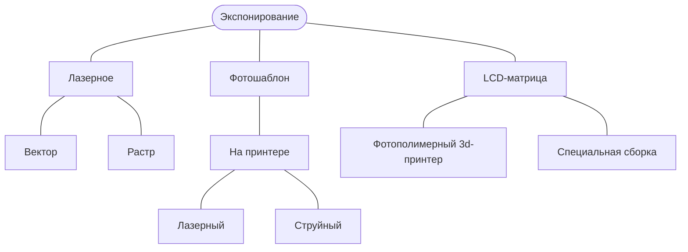

# Экспонирование

Лазерное экспонирование прекрасно подходит для прототипирования и изготовления плат небольшим сериями. Для этих целей требуется лазерный (с подходящей длиной волны) двухосевой станок с ЧПУ.  

Для больших серий есть смысл подумать о фотошаблонах. Также фотошаблоны применяют и при прототипировании, но это связано с дополнительными расходниками и процессами.  

К сожалению, об успешном применении LCD-матриц информации недостаточно. Как утверждают люди, которые использовали эту технологию, для экспонирования фоторезиста она годится. Но вот для засвечивания паяльной маски не подходит, из-за паразитной засветки, вызванной тем, что кристаллы в матрицах недостаточно "черные/контрастные".
