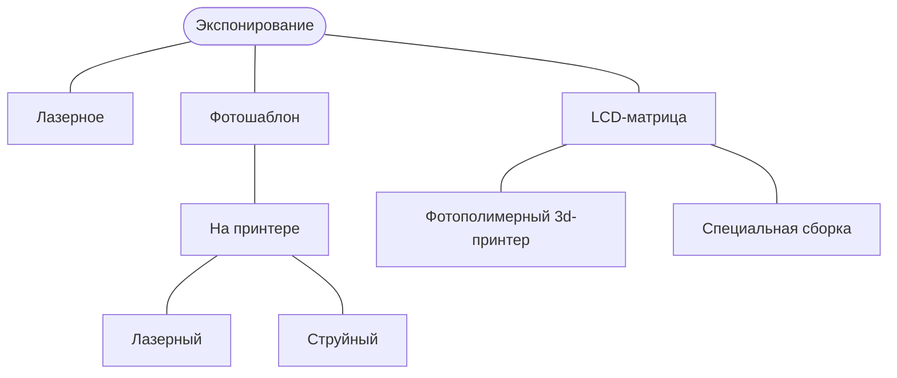

# Экспонирование

Производят на двухосевых станках с ЧПУ. Рабочим инструментом являются лазеры, содержащие в своем спектре достаточно УФ, подходящего для полимеризации фоторезистивных материалов. Мощность лазера подобных станков может начинаться от 5 мВт. Точность подобных станков зависит от способности к фокусировке установленного лазера и точности механики. Площадь изготавливаемой печатной платы на станках такого типа, фактически может быть ограничена только бюджетом построения двухосевой декартовой системы достаточной точности. Прекрасно подходит для прототипирования и изготовления плат небольшим сериями. 

Для больших серий есть смысл подумать о фотошаблонах. Также фотошаблоны применяют и при прототипировании, но это связано с дополнительными расходниками (пленка, принтер с максимально хорошим картриджем) и процессами (распечатка, вырезание, возможно, "уплотнение" изображения).

К сожалению, об успешном применении LCD-матриц информации недостаточно. Как утверждают люди, которые использовали эту технологию, для экспонирования фоторезиста она годится. Но вот для засвечивания паяльной маски не подходит, из-за паразитной засветки, вызванной тем, что кристаллы в матрицах недостаточно "черные/контрастные".
