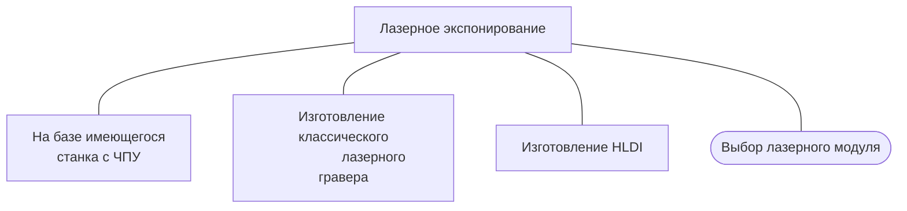

# Лазерное экспонирование

## На базе имеющегося станка с ЧПУ

Если имеется станок с ЧПУ с картезианской кинематикой или подобный станок планируется к приобретению, есть смысл подумать об оснастке его УФ лазерным модулем для экспонирования. Скорей всего придется немного поколдовать с софтом и железом (степень колдовства будет зависеть от типа станка, его прошивки и уровня желаемого удобства использования).

## Изготовление классического лазерного гравера

...
   
## HLDI

Если есть цель получить максимально совершенное и производительное устройство лазерного экспонирования двухосевой конструкции (напомню, здесь мы говорим о конструкциях применяемых в прототипировании и мелком кустарном производстве), то ваш выбор HLDI. Оптимизация под растровый режим позволяет получить максимальные скорости на одной оси, которые позвлояет механика станка. Также это дает возможность устанавливать по несколько лазеров на эту ось, что позволяет почти кратно увеличить скорость экспонирования. Для подобных станков контроллеры, софт и прошивки разрабатываются энтузиастами. Станки этой категории принято в рунете называть HLDI (Home Laser Direct Imaging). Привод каретки быстрой оси основан на двигателе постоянного тока. Позиция каретки определяется датчиком по энкодерной ленте. Зачастую, ось в сборе берут от струйного принтере и устанавливают на станок с минимальными конструктивными изменениями. За очень небольшой бюджет (до 70-90% комплектующих будут из старой оргтехники), можно собрать станок с точностью дорожка/зазор менее 0,1/0,1, площадью достигающей формата A4.
