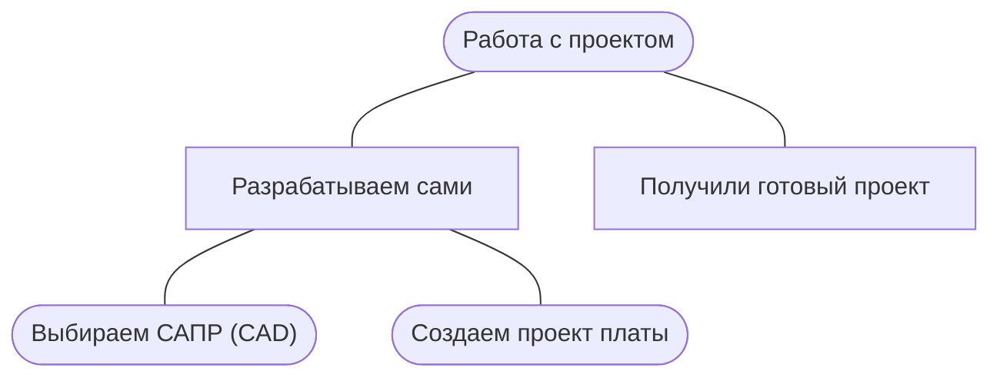

# Работа с проектом

Для изготовления печатной платы нам потребуются файлы. Это могут быть растровые или векторные изображения для фотошаблонов, шаблонов сверловки и др. Или же [Gerber](https://ru.wikipedia.org/wiki/Gerber){target="_blank"} файлы для создания управляющих программ на станках с ЧПУ. Эти управляющие программы создаются в CAM программах под оборудование на котором будет происходить процесс изготовления.
